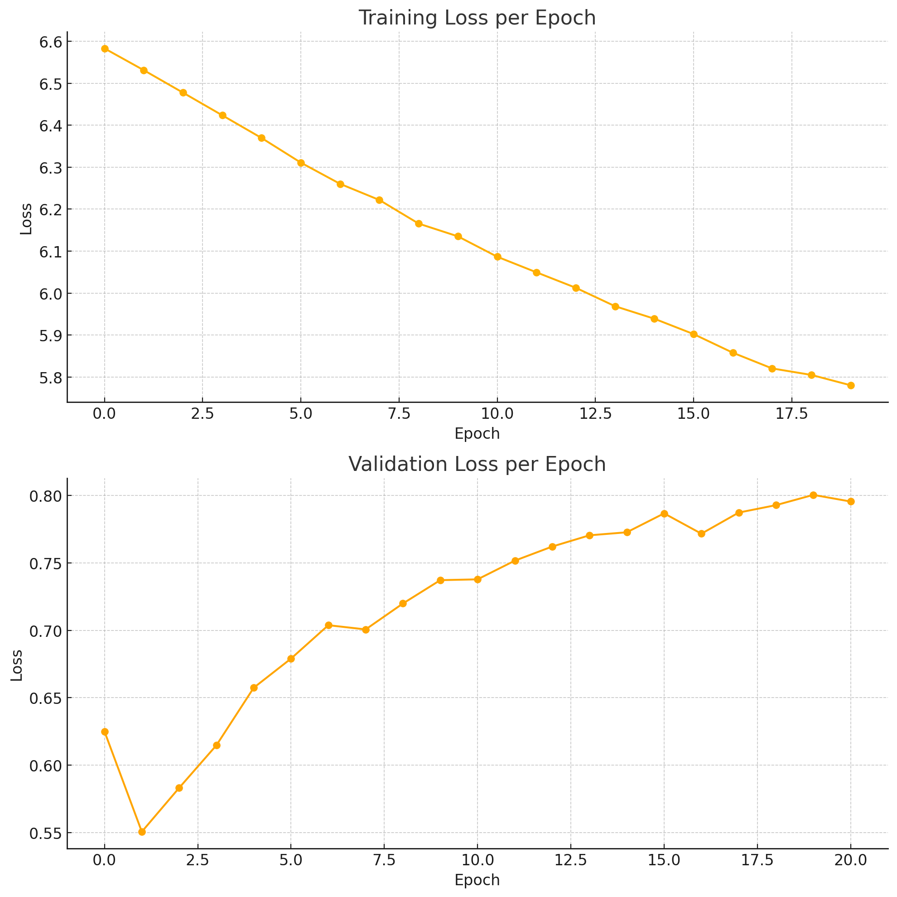

# Gainforest: Bioacoustic Classification for Amazon and Manaus Bird Species

  
  
  

<h1> Model - Wav2vec2 </h1>

<h1> Model - Metrics </h1>
<ul> 
 <li> Validation score: ROC-AUC Score (one-vs-rest) </li>
 <li> Training (backpropagation) loss: Weighted cross entropy  </li>
</ul>
<h1> Model - Performance </h1>

<h1> Huggingface Workflow (Gradio) </h1>

<ul>
<li>   User Inputs (Blue) User selects the model to use, uploads an audio file and chooses the time interval of interest.  </li>
<li>  Processing (Green) Audio class and bird species are inference using the model. Model inference results, waveform and mel-spectrogram of the audio are displayed. </li>
<li>   Bird Gallery (Red)  Picture of the predicted bird species are displayed for better understanding the inference result. The picture of birds were fetched via the ebird API. </li>
</ul>